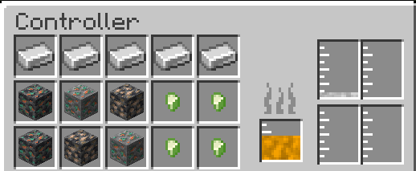

---
navigation:
    title: Controller
    icon: 'casting:controller'
    parent: index.md
    position: 10
item_ids:
    - 'casting:controller'

---

# Controller

## Controller

The Controller is the main block of the mod, this is where items are melted down into their molten variants. The Controller can be turned off when it receives a redstone signal

### GUI
The 15 slots on the left hold a max of 1 item each, these are the items that are melted down. The smaller tank on the right is the fuel tank. This shows the fuel of an adjacent fuel tank. This fuel is used to melt down the items. The 4 bigger tanks next to this are where the results of the melted items go. Each tanks holds a different fluid and 2 seperate tanks will not hold the same fluid. Durations show above the GUI and show per slot. 

<GameScene zoom="3" interactive={true}>
  <ImportStructure src="assets/structures/controller.nbt" />
</GameScene>

### Troubleshooting
If the controller is not melting an item make sure you have a tank adjacent that contains a fuel hot enough to melt the item
