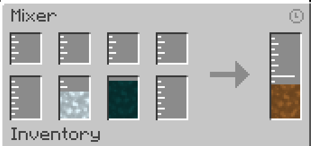

---
navigation:
    title: Mixer
    icon: 'casting:mixer'
    parent: index.md
    position: 30
item_ids:
    - 'casting:solidifier'

---

# Mixer

## Mixer

The Mixer is used to mix up to 4 different fluids into a different one. The Mixer can be turned off when it receives a redstone signal

### GUI
The top slots are the filter slots, if empty allows any fluid to enter one of the mixer tanks below. To filter you can either click on the slot with a bucket of the fluid or drag the fluid from JEI onto the slot. Below the filter slots are the 4 input tanks. The right tank is the output tank

<GameScene zoom="3" interactive={true}>
  <ImportStructure src="assets/structures/mixer.nbt" />
</GameScene>

### Troubleshooting
If the mixer is not mixing make sure you have enough of the fluids to mix and that the output tank accepts the result fluid.
