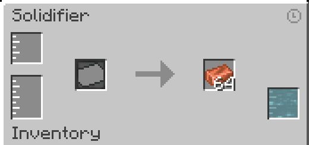

---
navigation:
    title: Solidifier
    icon: 'casting:solidifier'
    parent: index.md
    position: 20
item_ids:
    - 'casting:solidifier'

---

# Solidifier

## Solidifier

The Solidifier is a block that turns molten fluids into their solid variants by using various different molds. The Solidifier can be turned off when it receives a redstone signal

### GUI
The top left slot is the filter slot, if empty allows any fluid to enter the solidifier tank. To filter you can either click on the slot with a bucket of the fluid or drag the fluid from JEI onto the slot. The bottom left is the main solidifier tank. The middle item slot on the left is for molds. Molds are not consumed in the solidifier recipes though some recipes require other items. The slot to the right of the arrow is the output. The bottom right is the adjacent fuel tank. Filling this with a colder fuel will make the Solidifier run faster. Note the Solidifier does not need a coolant to work. 

<GameScene zoom="3" interactive={true}>
  <ImportStructure src="assets/structures/solidifier.nbt" />
</GameScene>

### Troubleshooting
If the solidifier is not solidifying make sure you are using the correct mold and have enough of the molten fluid in the solidifier tank
